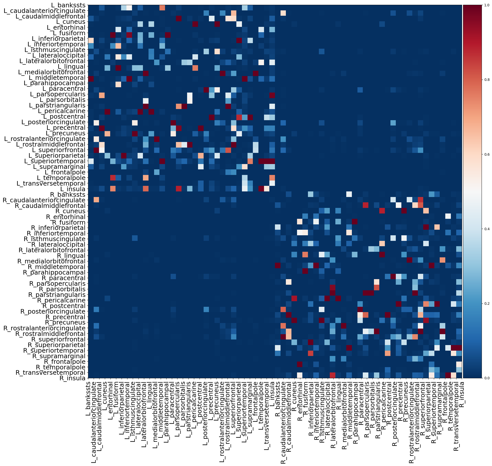
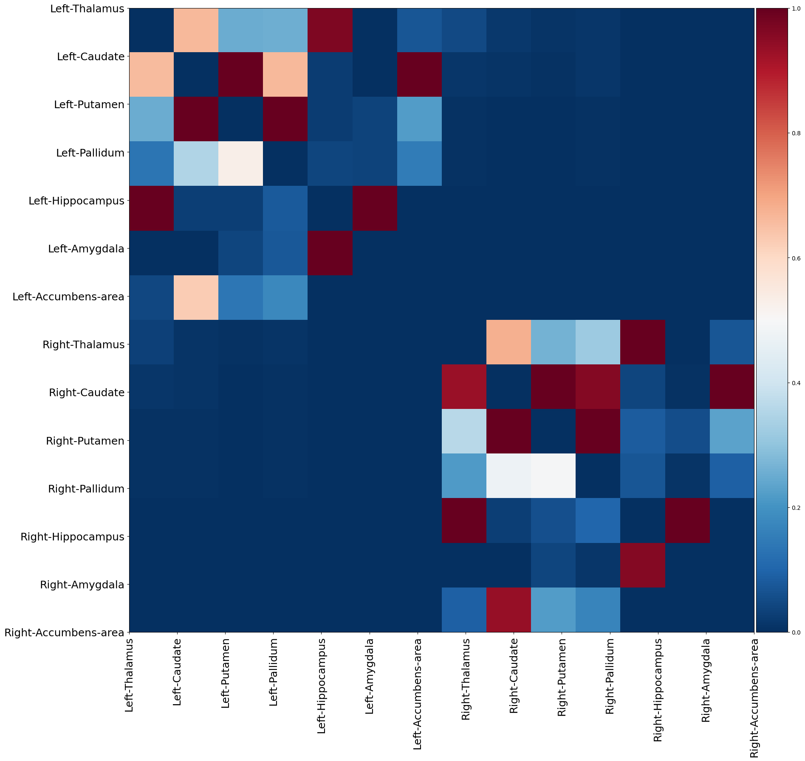
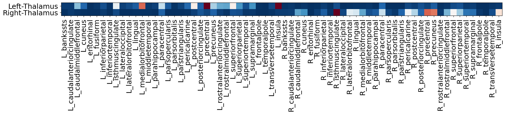

# Preprocessing of DTI Imaging Data

This repository provides a bash script (DTIprocess.sh) for batch processing of DTI data.
The processing steps in the script, briefly given below, closely follow the preprocessing procedure detailed in Oldham *et al.*, [^1], Deco *et al.*, [^2] and [BATMAN tutorial (pdf)](https://www.google.com/url?sa=t&rct=j&q=&esrc=s&source=web&cd=&cad=rja&uact=8&ved=2ahUKEwj_8uL86OKBAxUwm1YBHZZkAwoQFnoECBMQAQ&url=https%3A%2F%2Fosf.io%2Fpm9ba%2Fdownload&usg=AOvVaw2ny6I6EJAnmb6aazFib86N&opi=89978449).

[^1]: [S. Oldham, A. Arnatkevic Iūtė, R. E. Smith, J. Tiego, M. A. Bellgrove, A. Fornito, The efficacy of different preprocessing steps in reducing motion-related confounds in diffusion MRI connectomics. NeuroImage 222, 117252 (2020).](https://www.sciencedirect.com/science/article/pii/S1053811920307382?via%3Dihub)
[^2]: [Gustavo Deco et al., Dynamical consequences of regional heterogeneity in the brain's transcriptional landscape. Sci. Adv. 7, eabf4752 (2021). DOI: 10.1126/sciadv.abf4752](https://www.science.org/doi/10.1126/sciadv.abf4752)

## Before running the bash script...

Before running the script, make sure:
1. Software(s) needed are installed, and path settings are done at the beginning of the script.
2. Make sure the raw DTI data is in the RawDicom directory, and T1 files are in the nifti directory as indicated below. (Please also see the for details where these directories are formed).

## Software(s) needed and path settings

The DTI preprocessing requires [MRtrix](https://mrtrix.readthedocs.io/en/3.0.4/index.html) (heavily used), [FSL](https://fsl.fmrib.ox.ac.uk/fsl/fslwiki), [ANTS](https://picsl.upenn.edu/software/ants/), and [Freesurfer](https://surfer.nmr.mgh.harvard.edu). They must be installed on your computer before analysis.

Please edit the paths setting at the beginning of the shell script according to the path where the softwares are installed on your computer.

In the IBS heterobrainx workstation, all the necessary software is installed, and preprocessing would begin smoothly and would take nearly 2 hours for each participant to extract the fiber tracks.

## Directory settings

The anatomy_path contains the directories of participants; each participant's name begins with ibsxxxx. For example, if you have 25 participants, then the anatomy_path must have the following folders:

```
├── ibs0001
├── ibs0002
├── ibs0003
      .
      .
	  .

├── ibs0024
└── ibs0025
```

Inside each participant's directory, there must be directories with the name RawDicom that have the following structure:

```
├── ibs0001
│   └── RawDicom
            HEAD_PI_CNIR_IBS_20220805_100824_145000
                ├── 64CH_LOCALIZER_0001
                ├── DTI_SMS_64DIR_2_0ISO_0002
                ├── DTI_SMS_64DIR_2_0ISO_ADC_0003
                ├── DTI_SMS_64DIR_2_0ISO_COLFA_0006
                ├── DTI_SMS_64DIR_2_0ISO_FA_0005
                ├── DTI_SMS_64DIR_2_0ISO_TENSOR_0007
                ├── DTI_SMS_64DIR_2_0ISO_TRACEW_0004
                ├── PA_INVERT_DTI_SMS_64DIR_2_0ISO_0008
                ├── T1_MPRAGE_SAG_1_0ISO_0009
                └── T2_SPACE_SAG_1_0MM_0010

    └── nifti
        └── ibs0001_T1.nii.gz

```
The raw DTI directories in the RawDicom directory are  DTI_SMS_64DIR_2_0ISO_0002 (for AP) and PA_INVERT_DTI_SMS_64DIR_2_0ISO_0008 (for PA). Also, the nifti directory must contain the T1 file (Ex: ibs0001_T1.nii.gz). 


After the DTI processing for each participant is done, the preprocessed files are stored in the directory DTI. 
```
ibs0001
  ├── DTI
  ├── nifti
  └── RawDicom
```
The structural connectome csv file is stored in a directory specified at the beginning of the script. For each participant three connectome matrices are stored, namely Cortico-cortical, Subcortico-Subcortical, and Thalamo-cortical.  

## Preprocessing Steps

1. **Convert the Raw DICOM Data:**
   - Convert the raw DICOM DTI Anterior-to-Posterior (AP) and Posterior-to-Anterior (PA) datasets into MIF format (data format in MRtrix).
   - This conversion yields AP.mif and PA.mif files along with their bval and bvec files. These files are necessary for subsequent processing. Please use *dcm2niix* program in the command line to get the bval and bvec files automatically.

2. **Denoise the Data:**
   - Apply denoising techniques to the DTI data. This step is essential for improving data quality.

3. **Obtain Mean Denoised Images:**
   - Calculate the mean denoised AP and PA images and concatenate them. This mean image is needed for subsequent processing in Step 4.

4. **DWIFSLPreproc (Diffusion-weighted Image FSL Preprocessing):**
   - Begin the `dwifslpreproc`, which is the equivalent of the `recon` step for DTI. It deals with preprocessing tasks such as eddy current-induced distortion correction, motion correction, and (optionally) susceptibility-induced distortion correction. For more information, please see [dwifslpreproc documentation](https://mrtrix.readthedocs.io/en/3.0.4/dwi_preprocessing/dwifslpreproc.html).

5. **Outlier Detection:**
   - Detect participants with more than 5% outliers in their data and reject them if necessary.

6. **Bias Correction and Mask Generation:**
   - Apply bias correction and generate a mask to restrict the analysis to the brain-only region.

7. **Constrained Spherical Deconvolution:**
   - Use the Dhollander algorithm for constrained spherical deconvolution to extract participant-specific basis functions.

8. **Finding Fiber Orientation Distribution (FOD):**
   - Calculate the Fiber Orientation Distribution to describe the distribution of fiber orientations in the brain.

9. **Normalization of FOD:**
   - Normalize the FOD for each tissue type, which is necessary for group analysis and comparisons.

10. **Coregistration of T1 Anatomy:**
    - Coregister the T1 anatomy with the DTI data to verify the anatomical correctness of the DTI scans.

11. **Generate Streamlines:**
    - Create streamlines using anatomically constrained tractography. Multiple sets of streamlines may be generated, such as 10M, 200k, and 100k, depending on visualization needs and available resources.

12. **Streamline Refinement:**
    - Refine the streamlines if necessary to improve their accuracy and alignment with the underlying anatomy.

13. **Create Connectome:**
    - Generate a connectome using [tck2connectome](https://mrtrix.readthedocs.io/en/dev/reference/commands/tck2connectome.html) from the (refined) streamlines and store the connectome as a CSV file. The ROIs in the connectome correspond to the atlas specified while creating the connectome. We use the Desikan-Killany atlas with 68 cortical regions  and 16 subcortical regions  (including both left and right hemishpere) and thus, the connectome matrix is of size 84-by-84. 
14. **Connectome folder**
- Move the individual connectome csv file to the connectome folder. Since, in my project I deal with brain models for individual participants, I store the three connecome matrices for each participant. These matrices for one participant is displayed below.

> Cortico_coritcal

> Cortico_coritcal

> Thalamo_coritcal



